# PortionBridge Database Entity Relationship Diagram

```mermaid
erDiagram
    %% Core Tables
    users ||--o{ donation_requests : "creates (donor)"
    users ||--o{ donation_requests : "accepts (volunteer)"
    users ||--o{ teams : "leads"
    users ||--o{ team_members : "joins"
    users ||--o{ team_invitations : "invites"
    users ||--o{ team_invitations : "receives"
    users ||--o{ notifications : "receives"
    users ||--o{ reports : "files"
    users ||--o{ reports : "is reported"
    users ||--o{ ratings : "gives"
    users ||--o{ ratings : "receives"
    users ||--o{ chat_messages : "sends"
    users ||--o{ saved_addresses : "owns"
    users ||--o{ email_verifications : "verifies"
    users ||--o{ password_history : "changes"
    users ||--o{ refresh_tokens : "has"
    users ||--o{ audit_logs : "generates"
    users ||--o{ user_preferences : "sets"
    users ||--o{ notification_settings : "configures"
    users ||--o{ volunteer_profiles : "has"
    users ||--o{ user_achievements : "unlocks"

    %% Team Tables
    teams ||--o{ team_members : "has"
    teams ||--o{ team_invitations : "sends"
    teams ||--o{ donation_requests : "assigned to"

    team_members ||--|| users : "references"
    team_members ||--|| teams : "references"

    team_invitations ||--|| teams : "references"
    team_invitations ||--|| users : "invited by"
    team_invitations ||--o{ users : "invited user"

    %% Donation Tables
    donation_requests ||--o{ reports : "reported in"
    donation_requests ||--o{ ratings : "rated in"
    donation_requests ||--o{ chat_messages : "discussed in"
    donation_requests ||--o{ saved_addresses : "uses address"

    %% Achievement Tables
    user_achievements ||--|| users : "belongs to"
    user_achievements }o--|| achievement_definitions : "references"

    %% Table Definitions
    users {
        bigint id PK
        varchar name
        varchar email UK
        varchar password
        varchar role
        varchar phone
        text address
        varchar profile_photo
        varchar provider
        varchar google_id
        varchar profile_picture
        boolean is_banned
        boolean is_deleted
        boolean email_verified
        boolean phone_verified
        int failed_login_attempts
        datetime lock_until
        datetime last_login_at
        varchar last_login_ip
        varchar last_user_agent
        date date_of_birth
        varchar gender
        datetime created_at
        datetime updated_at
    }

    donation_requests {
        bigint id PK
        bigint donor_id FK
        bigint volunteer_id FK
        varchar assignment_mode
        bigint team_id FK
        bigint assigned_member_id FK
        varchar title
        varchar category
        varchar food_type
        varchar food_name
        decimal quantity
        varchar quantity_unit
        int number_of_servings
        varchar pickup_location
        datetime pickup_time
        date pickup_date
        varchar pickup_time_slot
        date expiry_date
        varchar contact_phone
        text description
        text ingredients
        json allergens
        varchar storage_requirement
        boolean is_vegetarian
        boolean is_halal
        boolean refrigeration_required
        varchar clothing_category
        varchar gender
        varchar age_group
        varchar item_condition
        varchar brand
        varchar size
        varchar color
        varchar season
        json images
        text additional_notes
        bigint saved_address_id FK
        json pickup_address_details
        varchar photo
        datetime scheduled_at
        datetime accepted_at
        datetime completed_at
        varchar status
        boolean is_deleted
        datetime deleted_at
        datetime created_at
        datetime updated_at
    }

    teams {
        bigint id PK
        varchar name
        text description
        bigint leader_id FK
        datetime created_at
        datetime updated_at
    }

    team_members {
        bigint id PK
        bigint team_id FK
        bigint user_id FK
        varchar role
        datetime joined_at
    }

    team_invitations {
        bigint id PK
        bigint team_id FK
        bigint invited_by FK
        bigint invited_user_id FK
        varchar invited_email
        varchar status
        datetime expires_at
        datetime responded_at
        datetime created_at
    }

    notifications {
        bigint id PK
        bigint user_id FK
        varchar type
        varchar title
        text message
        bigint related_id FK
        boolean is_read
        datetime created_at
    }

    reports {
        bigint id PK
        bigint reporter_id FK
        bigint reported_user_id FK
        bigint reported_donation_id FK
        varchar reason
        text details
        text resolution_notes
        varchar status
        bigint resolved_by FK
        datetime resolved_at
        datetime created_at
        datetime updated_at
    }

    ratings {
        bigint id PK
        bigint donation_request_id FK
        bigint rated_by FK
        bigint rated_user FK
        int stars
        text comment
        datetime created_at
    }

    chat_messages {
        bigint id PK
        bigint donation_request_id FK
        bigint sender_id FK
        text message
        boolean is_read
        datetime created_at
    }

    saved_addresses {
        bigint id PK
        bigint user_id FK
        varchar label
        varchar custom_label
        text full_address
        varchar division
        varchar district
        varchar area
        varchar postal_code
        varchar building_name
        varchar floor
        varchar landmark
        text delivery_instructions
        decimal latitude
        decimal longitude
        varchar contact_person_name
        varchar contact_phone
        boolean is_default
        datetime created_at
        datetime updated_at
    }

    email_verifications {
        bigint id PK
        bigint user_id FK
        varchar token
        varchar email
        datetime expires_at
        boolean verified
        datetime verified_at
        datetime created_at
    }

    password_history {
        bigint id PK
        bigint user_id FK
        varchar password_hash
        datetime created_at
    }

    refresh_tokens {
        bigint id PK
        bigint user_id FK
        varchar token
        datetime expires_at
        datetime created_at
    }

    audit_logs {
        bigint id PK
        bigint user_id FK
        varchar action
        text details
        varchar ip_address
        varchar user_agent
        datetime created_at
    }

    user_preferences {
        bigint id PK
        bigint user_id FK
        json preferences
        datetime updated_at
    }

    notification_settings {
        bigint id PK
        bigint user_id FK
        json settings
        datetime updated_at
    }

    volunteer_profiles {
        bigint id PK
        bigint user_id FK
        varchar service_area
        text bio
        varchar availability
        json skills
        datetime created_at
        datetime updated_at
    }

    user_achievements {
        bigint id PK
        bigint user_id FK
        varchar achievement_type
        varchar achievement_name
        text description
        varchar icon
        datetime unlocked_at
    }

    achievement_definitions {
        varchar type PK
        varchar name
        text description
        varchar icon
        int points
        varchar role
        boolean is_active
    }

    %% Views (Virtual Tables)
    top_donors {
        bigint user_id PK
        varchar donor_name
        varchar profile_photo
        int total_donations
        int completed_count
        decimal total_quantity_donated
        decimal average_rating
    }

    top_volunteers {
        bigint user_id PK
        varchar volunteer_name
        varchar profile_photo
        int total_pickups
        int completed_count
        decimal average_rating
    }
```

## Table Relationships Summary

### Core User Relationships
- **users** is the central table connected to almost all other tables
- Each user can be a donor (creates donation_requests) or volunteer (accepts donation_requests)
- Users can lead teams (teams.leader_id) or be team members (team_members)
- Users can send/receive team invitations

### Donation Flow
- **donation_requests** connects donors and volunteers
- Status flow: pending → accepted → scheduled → on_the_way → picked_up → completed
- Donations can be assigned to teams (team_id) or individual volunteers (volunteer_id)
- Donations use saved addresses for pickup locations

### Team System
- **teams** have a leader (users table)
- **team_members** defines membership with roles (leader/member)
- **team_invitations** manages team joining process

### Communication & Feedback
- **chat_messages** enables donor-volunteer communication per donation
- **ratings** allows donors to rate volunteers after completion
- **reports** enables reporting users or donations
- **notifications** system-wide notification delivery

### Supporting Tables
- **saved_addresses** - reusable pickup addresses for donors
- **email_verifications** - email verification flow
- **password_history** - password change tracking
- **refresh_tokens** - JWT refresh token management
- **audit_logs** - system audit trail
- **user_preferences** - user-specific preferences
- **notification_settings** - notification preferences
- **volunteer_profiles** - volunteer-specific profile data
- **user_achievements** - gamification achievements
- **achievement_definitions** - achievement templates

### Views (Aggregated Data)
- **top_donors** - leaderboard view for top donors
- **top_volunteers** - leaderboard view for top volunteers

## Indexes & Constraints

### Unique Constraints
- users.email
- reports (reporter_id, reported_donation_id) - one report per user per donation
- ratings (donation_request_id, rated_by) - one rating per donation per rater

### Foreign Key Relationships
- All *_id fields reference the primary key of their respective tables
- Soft deletes implemented via is_deleted flag on key tables
- Cascade rules handled at application level

## Status Enums

### Donation Status
- pending
- accepted
- scheduled
- on_the_way
- picked_up
- completed
- cancelled

### Report Status
- pending
- reviewed
- resolved
- dismissed

### Team Invitation Status
- pending
- accepted
- declined
- expired

### User Roles
- donor
- volunteer
- admin
