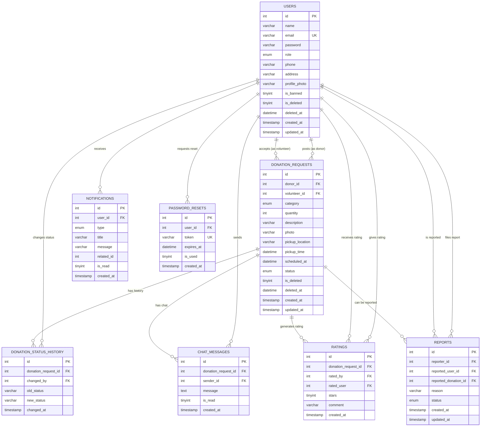

# PortionBridge — Entity Relationship Diagram

## Diagram (Mermaid ER syntax — renders on GitHub and most Markdown viewers)

---

## Entity Overview

| Entity | Role |
|---|---|
| **users** | Central entity. Every Donor, Volunteer, and Admin account. |
| **password_resets** | Supports forgot-password token/OTP flow (schema-only in this phase). |
| **donation_requests** | The core transactional entity — one row per donation post, tracking its full lifecycle. |
| **donation_status_history** | Append-only audit log of every status transition on a donation request. |
| **chat_messages** | Messages exchanged between donor and volunteer, scoped to one donation request. |
| **notifications** | Per-user in-app notifications, auto-generated by triggers on key events. |
| **ratings** | Post-completion mutual ratings between donor and volunteer. |
| **reports** | Flags raised against a user or a donation post, reviewed by an Admin. |

---

## Relationship Summary

| Relationship | Cardinality | Notes |
|---|---|---|
| users → donation_requests (as donor) | 1 : N | `donor_id` FK, `ON DELETE CASCADE` |
| users → donation_requests (as volunteer) | 1 : N | `volunteer_id` FK, nullable, `ON DELETE SET NULL` |
| donation_requests → donation_status_history | 1 : N | `ON DELETE CASCADE` |
| users → donation_status_history (changed_by) | 1 : N | nullable, `ON DELETE SET NULL` (preserves history even if the user is later deleted) |
| donation_requests → chat_messages | 1 : N | `ON DELETE CASCADE` |
| users → chat_messages (sender) | 1 : N | `ON DELETE CASCADE` |
| users → notifications | 1 : N | `ON DELETE CASCADE` |
| donation_requests → ratings | 1 : N | one rating per (donation, rater) pair via UNIQUE constraint |
| users → ratings (rated_by / rated_user) | 1 : N (both directions) | `ON DELETE CASCADE` |
| users → reports (reporter) | 1 : N | `ON DELETE CASCADE` |
| users → reports (reported_user, nullable) | 1 : N | `ON DELETE CASCADE` |
| donation_requests → reports (reported_donation, nullable) | 1 : N | `ON DELETE CASCADE` |
| users → password_resets | 1 : N | `ON DELETE CASCADE` |

---

## Why This Is 3NF

- **1NF**: Every column holds a single atomic value (no comma-separated lists, no repeating groups — e.g. chat messages are individual rows, not a JSON blob on the donation request).
- **2NF**: Every table has a single-column surrogate primary key (`id`), so there are no partial-key dependencies to worry about (no composite primary keys with partial dependency).
- **3NF**: No transitive dependencies. For example, `donation_requests` does not store the donor's name or email (that would transitively depend on `donor_id` → `users.id`) — it only stores the `donor_id` foreign key, and the donor's details are looked up via JOIN.

---

## Design Notes

- **Soft delete**: `users.is_deleted` and `donation_requests.is_deleted` (with matching `deleted_at`) mean rows are never hard-deleted from these two tables — they're excluded from normal queries via `WHERE is_deleted = 0` instead.
- **Polymorphic `notifications.related_id`**: Intentionally has no FK constraint, since it can reference different tables (e.g. a donation request id) depending on `notifications.type`. The mapping is handled at the application layer.
- **`reports` target flexibility**: A report can target either a user OR a donation post (or both) — enforced via the `chk_reports_target_present` CHECK constraint requiring at least one to be non-null.
